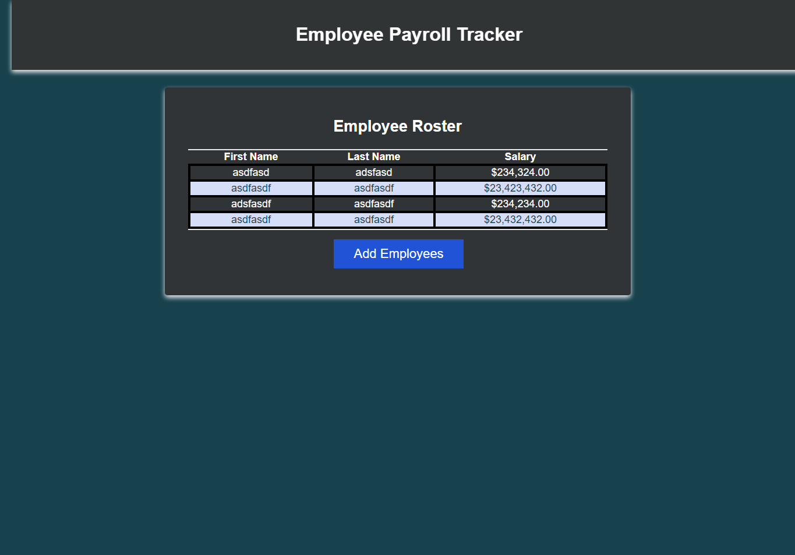
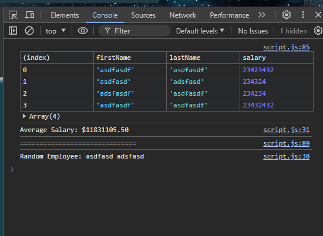

# Employee Payroll Tracker

## Description

The Employee Payroll Tracker is a web application that allows you to add employees, track their data, and display the employee roster. It provides functionalities to collect employee information, display the average salary, select a random employee, and sort employees by last name. The application uses HTML, CSS, and JavaScript for the front-end.

## Features

- Add employees with first name, last name, and salary.
- Display the employee roster in a table format.
- Calculate and display the average salary.
- Select and display a random employee.
- Sort employees by last name.

## Usage

1. Open the `index.html` file in a web browser.
2. Click the "Add Employees" button to start adding employees.
3. Enter the first name, last name, and salary for each employee in the prompt dialogs.
4. The application will display the employee roster, calculate and display the average salary, and select and display a random employee.

